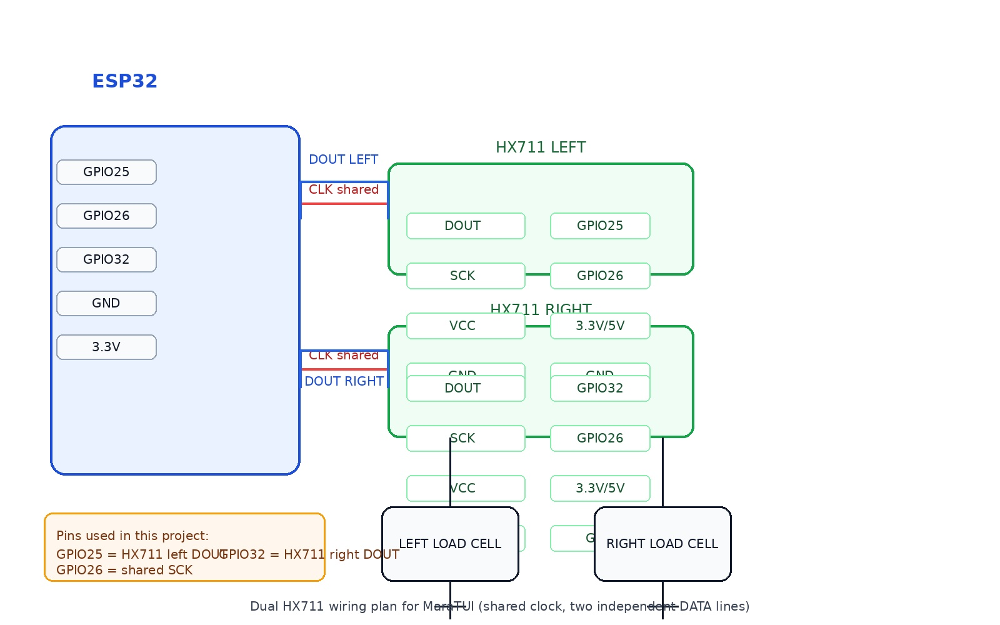
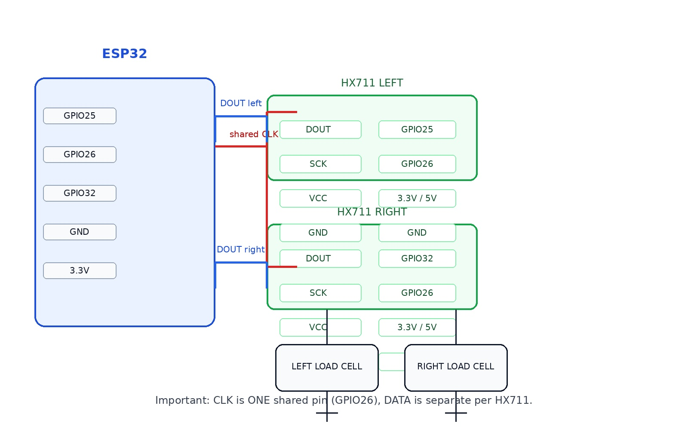
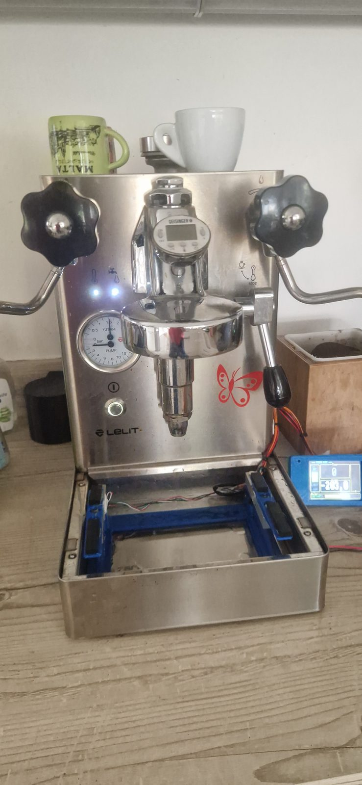
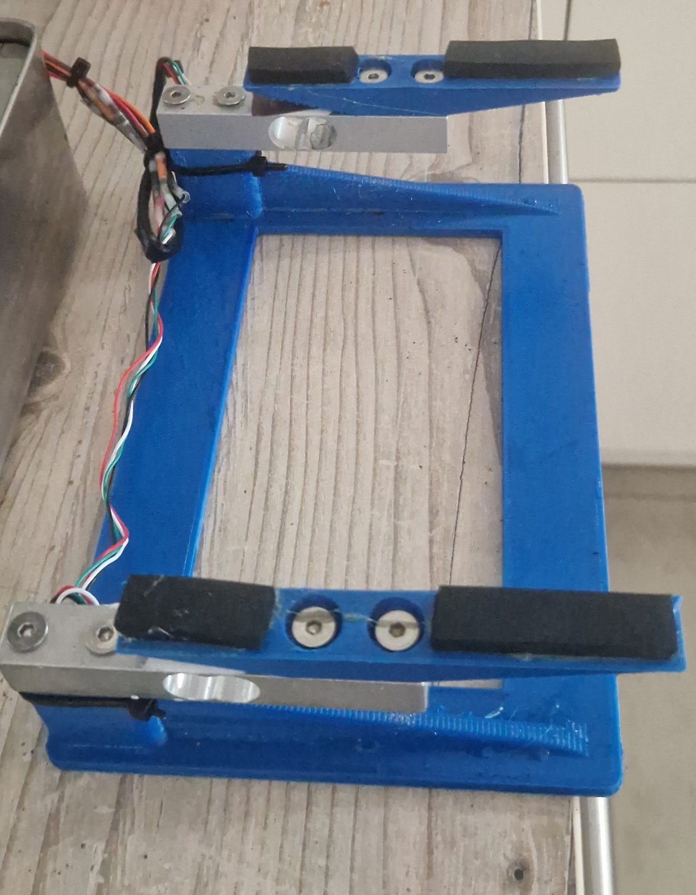
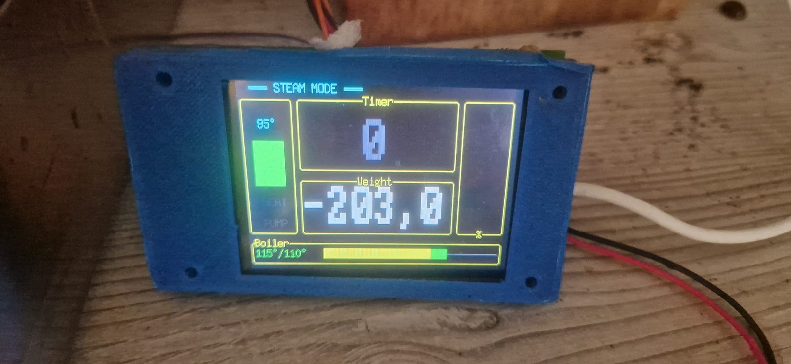

# Hardware Wiring

Target board: **ESP32 Type-C** (generic) with external **ILI9341** 240x320 TFT display.

| ESP32 Type-C | ILI9341 Display |
|:---:|:---:|
|  |  |

## Complete Pin Mapping

Tested board: **ESP32 DevKitV1** (30-pin WROOM-32 "DOIT DEVKIT V1" layout). The
`D<n>` column is that board's silkscreen label, which is just `GPIO<n>` — use whichever
matches your board.

| ESP32 GPIO | DevKitV1 label | Function | Direction | Notes |
|------------|-----------------|----------|-----------|-------|
| GPIO12     | D12  | Button 1 | Input     | Internal pull-up, active LOW. Boot-strapping pin (sets flash voltage); safe here since the button only pulls it LOW, and the internal pull-up is applied by software after boot, not during strapping. |
| GPIO14     | D14  | Display backlight | Output | HIGH = on |
| GPIO16     | D16 (silkscreen "RX2") | UART1 RX | Input     | Lelit Mara X telemetry. "RX2" label is just a UART2 suggestion — used here as plain GPIO for UART1 |
| GPIO17     | D17 (silkscreen "TX2") | UART1 TX | Output    | Lelit Mara X telemetry (unused by device, wired for symmetry) |
| GPIO18     | D18  | Display SCK / CLK | Output | VSPI CLK |
| GPIO19     | D19  | Display CS | Output   | VSPI Chip Select |
| GPIO21     | D21  | Display SDA / MOSI | Output | VSPI MOSI |
| GPIO22     | D22  | Display RST | Output  | Hardware reset |
| GPIO23     | D23  | Display DC / RS | Output | Data/Command select |
| GPIO25     | D25  | HX711 DOUT (left)  | Input  | Left load cell |
| GPIO26     | D26  | HX711 SCK (left)   | Output | Left load cell |
| GPIO27     | D27  | HX711 SCK (right)  | Output | Right load cell |
| GPIO32     | D32  | HX711 DOUT (right) | Input  | Right load cell |

Details for each subsystem below.

## Pinout

### SPI Display (ILI9341)

| Display Pin | ESP32 GPIO | Notes |
|-------------|------------|-------|
| SCK / CLK   | GPIO18     | VSPI CLK |
| SDA / MOSI  | GPIO21     | VSPI MOSI |
| DC / RS     | GPIO23     | Data/Command select |
| CS          | GPIO19     | Chip Select |
| RST / RESET | GPIO22     | Hardware reset |
| LED / BLK   | GPIO14     | Backlight (driven HIGH = on) |
| VCC         | 3.3V       | |
| GND         | GND        | |

### UART (Lelit Mara X telemetry)

| Function | ESP32 GPIO | Notes |
|----------|------------|-------|
| TX       | GPIO17     | UART1 TX |
| RX       | GPIO16     | UART1 RX |

### Button

| Button   | ESP32 GPIO | Notes |
|----------|------------|-------|
| Button 1 | GPIO12     | Internal pull-up enabled |

Button connects GPIO to **GND** through a tactile switch (active LOW, NegEdge detection).
Short press (< 500 ms): toggle Dashboard ↔ Graphs. Two short presses released within 400 ms
of each other count as a double press instead: zero the scale (see below). Because a lone
short press can't be told apart from the first half of a double press until that 400 ms
window has passed without a second press, every short-press action (screen toggle, backlight
wake) fires up to ~400 ms after release, not instantly. Long press (≥ 500 ms, < 3 s): toggle
Debug screen. Hold ≥ 3 s: start the scale calibration wizard (see below).

### Scale (dual HX711 load-cell amplifiers)

The scale uses **two independent HX711 amplifiers**, each wired to its own load cell
(e.g. one under each side of the drip tray) with its own DOUT *and* SCK line — the two
ADCs are clocked separately rather than sharing one clock. Their raw readings are
calibrated independently and summed into the total weight shown on the Dashboard.

| HX711 Pin    | ESP32 GPIO | Notes |
|--------------|------------|-------|
| DOUT (left)  | GPIO25     | Data, left load cell (input on ESP32) |
| SCK (left)   | GPIO26     | Clock, left load cell (output from ESP32) |
| DOUT (right) | GPIO32     | Data, right load cell (input on ESP32) |
| SCK (right)  | GPIO27     | Clock, right load cell (output from ESP32) |
| VCC (both)   | 3.3V / 5V  | Per HX711 board spec |
| GND (both)   | GND        | |

|  |  |
|:---:|:---:|

Each load cell connects to its own HX711 board's E+/E-/A+/A- terminals per the load
cell's datasheet. Both drivers read channel A at gain 128 (the HX711 default).

#### Calibrating the scale

Calibration data (per-cell zero-point offset + counts-per-gram factor) is stored in NVS
flash and survives reboots. The wizard calibrates the **left cell first, then the right
cell**, each with its own zero + reference step. To (re-)calibrate:

1. Hold **Button 1** for 3 seconds to enter the calibration wizard.
2. **Left cell — zero point:** remove everything from the scale, then short-press Button 1
   to confirm. The device tares the left HX711 (averages ~10 raw samples as the
   zero-point).
3. **Left cell — reference weight:** place a **500 g** reference weight on the scale, then
   short-press Button 1 to confirm. The device computes the left cell's counts-per-gram
   scale factor from this reading.
4. **Right cell — zero point / reference weight:** repeat steps 2–3 for the right cell.
5. A result screen confirms success for both cells (or reports a read failure — check
   wiring and retry). Press either button to dismiss and return to the previous screen.

A long press at any step during the wizard cancels without changing the stored
calibration. The Dashboard shows live weight (left + right combined) once calibrated; it
auto-tares both cells the moment a shot starts, so it displays the net extracted weight. It
also auto-tares once on the very first reading after boot, and a fast double press zeroes it
manually at any time (ignored while the calibration wizard itself is active).

Before the wizard has ever been run (nothing saved to NVS yet), the scale is uncalibrated
(`ScaleCalibration::default()`, `scale = 0.0`) and readings are rejected outright — the
Dashboard shows `--` until calibration completes.

#### Finished build

The scale mount installed in the Mara X's drip tray, and the Dashboard showing a live weight
reading:

|  |  |  |
|:---:|:---:|:---:|
