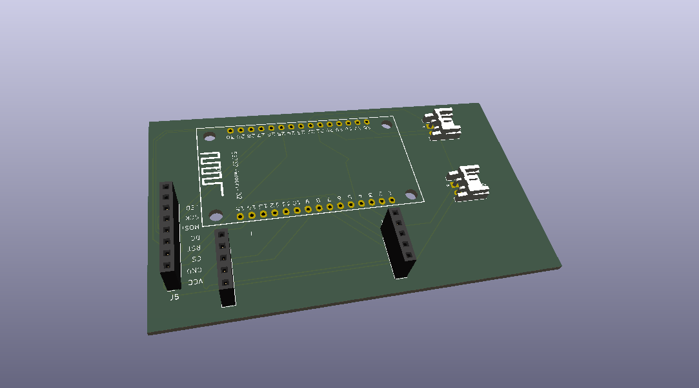

# MaraTUI PCB

Custom ESP32 controller board for the [Lelit Mara X](https://lelitcoffee.com/product/mara-x/) espresso machine.

## PCB Render

## Components

| Ref | Part | Link |
|-----|------|------|
| U1 | ILI9341 2.8" SPI TFT with touch | [Amazon TR](https://www.amazon.com.tr/2-8in%C3%A7-SPI-Dokunmatik-Ekran-Mod%C3%BCl%C3%BC/dp/B0GWFFJBZN) |
| U2 | ESP32-WROOM-32 | [Amazon TR](https://www.amazon.com.tr/ESP32-Wroom-32-Wifi-Bluetooth-Geli%C5%9Ftirme-Kart%C4%B1/dp/B0BT7SW1LF) |
| SW1 | Tactile switch | |
| J1 | Barrel jack (power) | |
| J2 | 3-pin connector (GND + UART) | |
| U3, U4 | HX711 load-cell amplifier (one per scale cell) | |

## Wiring

### SPI Display (ILI9341)

| Display Pin | ESP32 GPIO | Notes |
|-------------|------------|-------|
| SCK / CLK   | GPIO18     | VSPI CLK |
| SDA / MOSI  | GPIO21     | VSPI MOSI |
| DC / RS     | GPIO23     | Data/Command select |
| CS          | GPIO19     | Chip Select |
| RST / RESET | GPIO22     | Hardware reset |
| LED / BLK   | GPIO14     | Backlight (HIGH = on) |
| VCC         | 3.3V       | |
| GND         | GND        | |

### UART (Lelit Mara X telemetry)

| Function | ESP32 GPIO | Notes |
|----------|------------|-------|
| TX       | GPIO17     | UART1 TX |
| RX       | GPIO16     | UART1 RX |

### Scale (dual HX711 load cells)

| HX711 Pin    | ESP32 GPIO | Notes |
|--------------|------------|-------|
| DOUT (left)  | GPIO25     | Data, left load cell (input on ESP32) |
| SCK (left)   | GPIO26     | Clock, left load cell (output from ESP32) |
| DOUT (right) | GPIO32     | Data, right load cell (input on ESP32) |
| SCK (right)  | GPIO27     | Clock, right load cell (output from ESP32) |

Each HX711 has its **own** DOUT and SCK line (not shared) so the two cells can be clocked and
read independently — one under each side of the drip tray. See
[`docs/hardware.md`](../docs/hardware.md) for E+/E-/A+/A- load-cell wiring and the calibration
procedure.

### Button

| Button   | ESP32 GPIO | Notes |
|----------|------------|-------|
| SW1      | GPIO12     | Internal pull-up enabled |

Button connects GPIO to **GND** via a tactile switch (active LOW, falling-edge detection).

- Short press (< 500 ms): cycle screens (Dashboard ↔ Graphs)
- Long press (≥ 500 ms): toggle Debug screen
- Hold (3 s): start the scale calibration wizard

## Custom Libraries

Non-standard components are bundled in `lib/` so the project opens without missing library errors on any machine.

| File | Description |
|------|-------------|
| `lib/symbols/esp32_30pin.kicad_sym` | ESP32-WROOM-32 symbol |
| `lib/symbols/tft_320x240.kicad_sym` | ILI9341 320×240 symbol |
| `lib/footprints/maratui.pretty/ESP32_30pin.kicad_mod` | ESP32 footprint |
| `lib/footprints/maratui.pretty/TFT-320x240.kicad_mod` | TFT display footprint |

## Manufacturing

Gerber files for fabrication: `gerbers/gerbers.zip` (base board), `gerbers/260903_Platine_waage.zip` (scale add-on board)

## 3D-Printed Parts (`3d-print/`)

Printable case parts for the dual load-cell scale mount:

| File | Description |
|------|-------------|
| `doppelfuss.stp` / `ImageToStl.com_doppelfuss.stl` | Double foot — mounts both load cells |
| `auflage_v2.stp` / `ImageToStl.com_auflage_v2.stl` | Scale platform/tray (v2) |
| `CCR10S_ImageToStl.com_auflage_v2.gcode` | Pre-sliced G-code for the platform (Creality CR-10S) |

Tested with JLCPCB default 2-layer settings.
